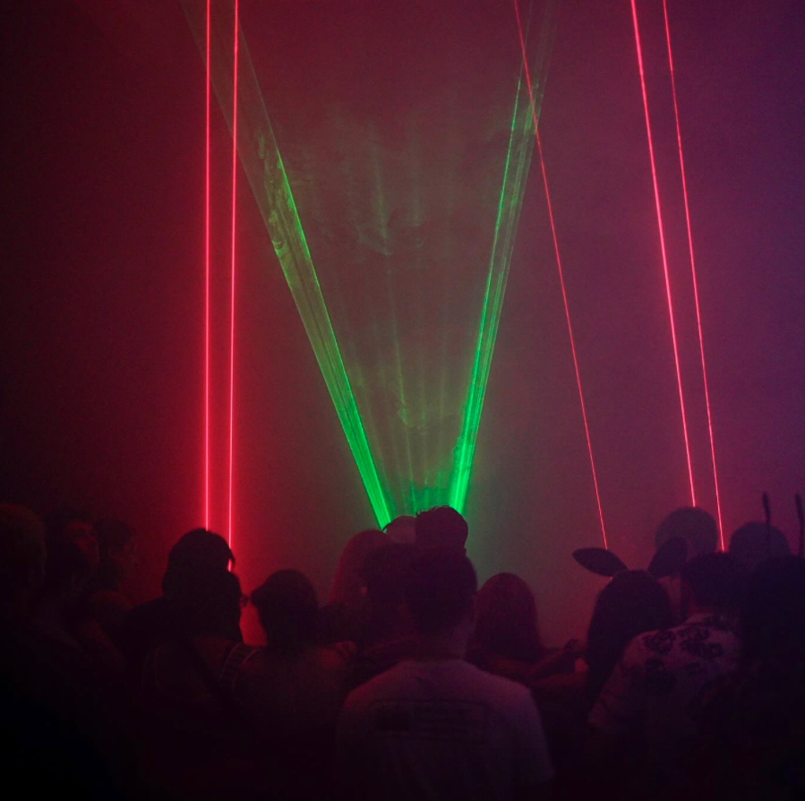
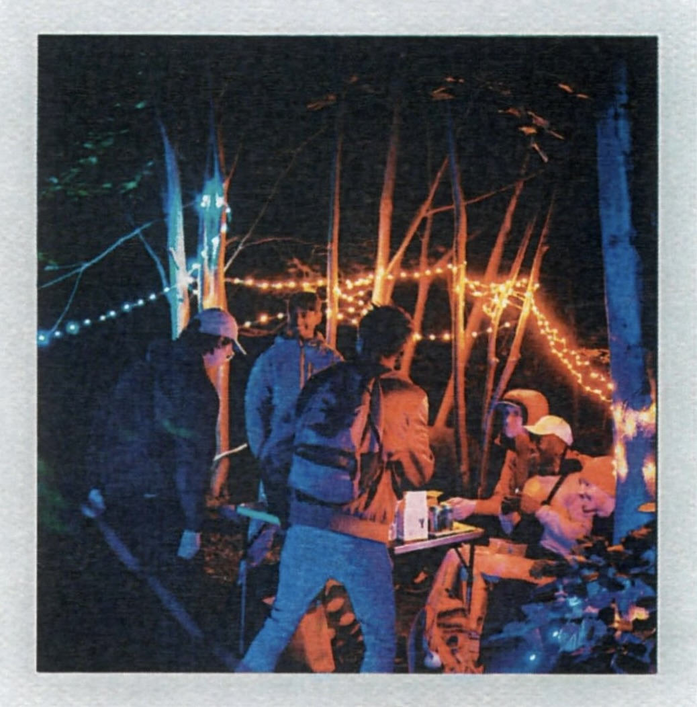

During my two-year involvement with the Sunflower Dance Collective (SDC), I gained extensive experience in event organisation and management, working in a variety of roles to ensure successful events at numerous venues across London.

My responsibilities included the set up and management of equipment, sound and light setups for both indoor and outdoor events and working closely with event spaces and clubs to ensure everything ran smoothly.

As the Bar Manager, I oversaw the bar operations, managing inventory, staff, and customer service to create a welcoming and efficient environment. Additionally, I was involved in organising the venue, liaising with acts, DJs, and musicians to ensure their requirements were met and events proceeded without any issues. My role required strong communication skills, adaptability, and a proactive approach to problem-solving.

Beyond these core duties, I also occasionally served as the event photographer, capturing the energy and atmosphere of each event for promotional use.
These roles helped me to develop a broad skill set in event logistics, team management, and client relations. My experience has equipped me with the ability to work under pressure, maintain a high level of organisation, and deliver memorable experiences in dynamic and diverse environments.

  

    

      
      

        
Available SDC Merchandise

      

    

    

      
      

        
Advertisement of First Event

      

    

    

      
      

        
Image at Outdoor Event

      

    

    

      
      

        
Weekly Open Decks Event

      

    

    

      
      

        
Advertisement for Event at The Social

      

    

  

  <a class="carousel-control-prev" href="#sunflowerCarousel" role="button" data-slide="prev">
    
    Previous
  </a>
  <a class="carousel-control-next" href="#sunflowerCarousel" role="button" data-slide="next">
    
    Next
  </a>

