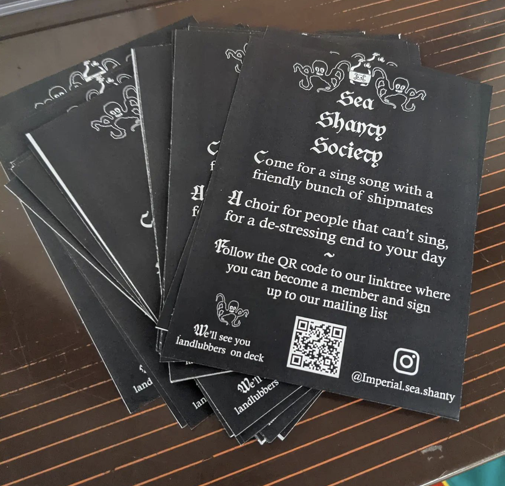

My passion for music began at a young age when, at the age of seven, I began to learn the piano. Later I expanded my repertoire to include the flute, a range of saxophones (soprano, alto, tenor, and baritone), and the tenor banjo. My passion for music led me to participate in a variety of ensembles throughout my teenage years and beyond, including big bands, jazz bands and sax quartets. I also had the opportunity to perform solo.

My interest in singing and its positive impact on mental health inspired me to co-found [Imperial College’s Sea Shanty Choir](https://www.imperialcollegeunion.org/activities/a-to-z/sea-shanty). Recognising the need for connection and community in the wake of the COVID-19 pandemic, we organised and taught sea shanty singing to help combat student isolation and loneliness, leveraging the well-documented benefits of communal singing for mental well-being. You can learn more about this choir here.

My commitment to this unique musical tradition encouraged me to join the London Sea Shanty Collective, where I continue to explore and share the rich heritage of sea shanties. The collective’s mission aligns with my belief in music as a powerful tool for building community. For more information about the London Sea Shanty Collective, visit their [page](https://londonseashantycollective.com).

  

    

      
      

        
Imperial College Sea Shanty Choir Logo

      

    

    

      
      

        
The Co-Founders of the Imperial College Sea Shanty Choir

      

    

    

      
      

        
Posters from First Sea Shanty Session

      

    

    

      
      

        
London Sea Shanty Collective Performing Live

      

    

  

  <a class="carousel-control-prev" href="#musicGalleryCarousel" role="button" data-slide="prev">
    
    Previous
  </a>
  <a class="carousel-control-next" href="#musicGalleryCarousel" role="button" data-slide="next">
    
    Next
  </a>

---
