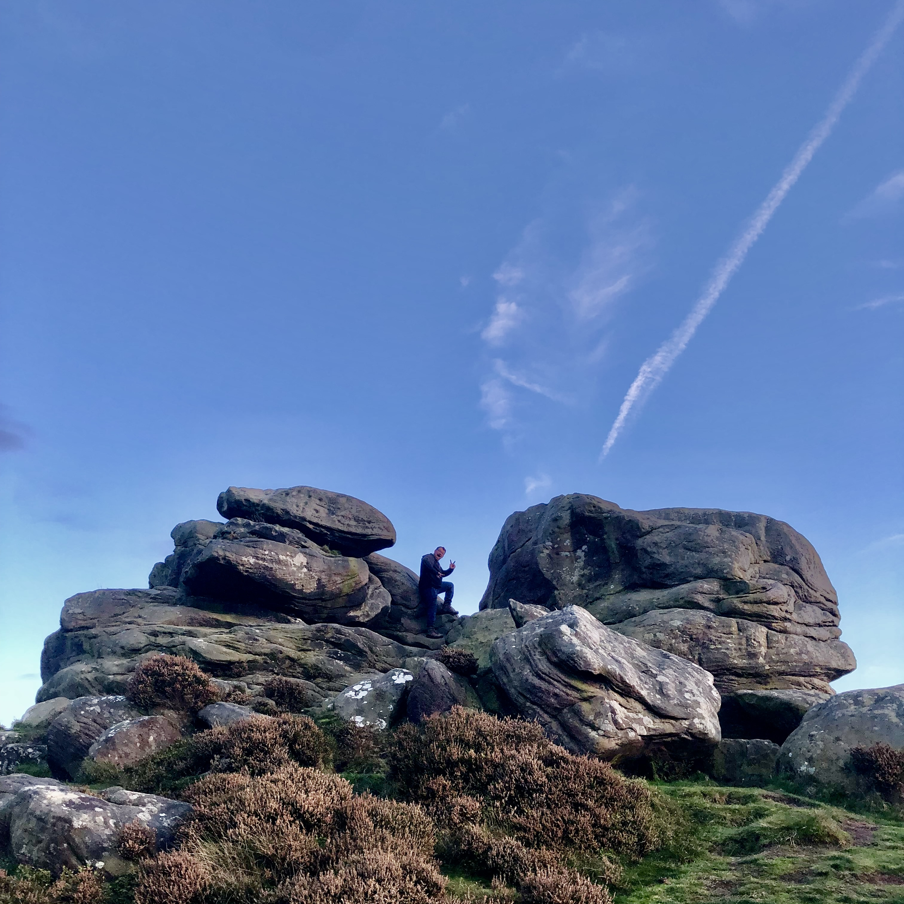
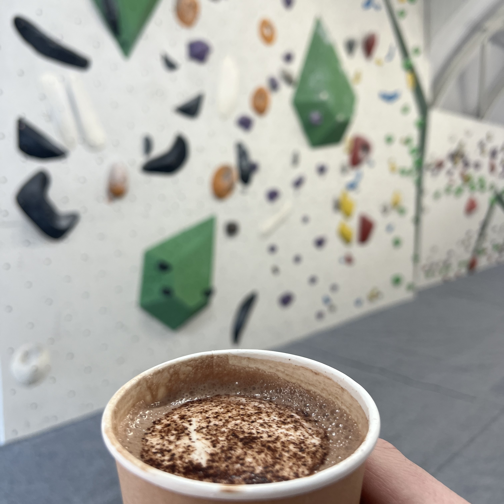
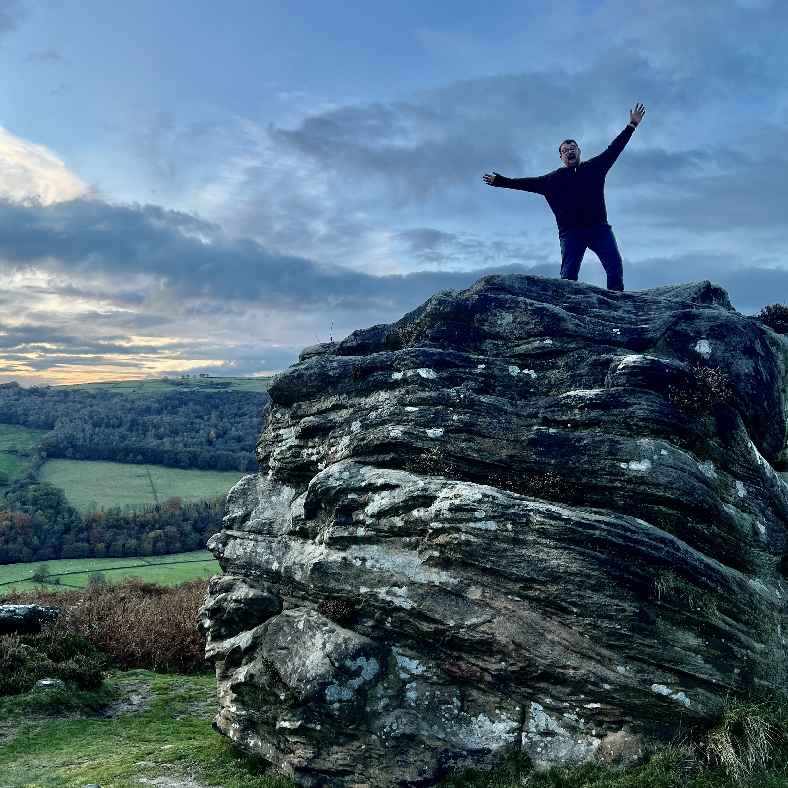
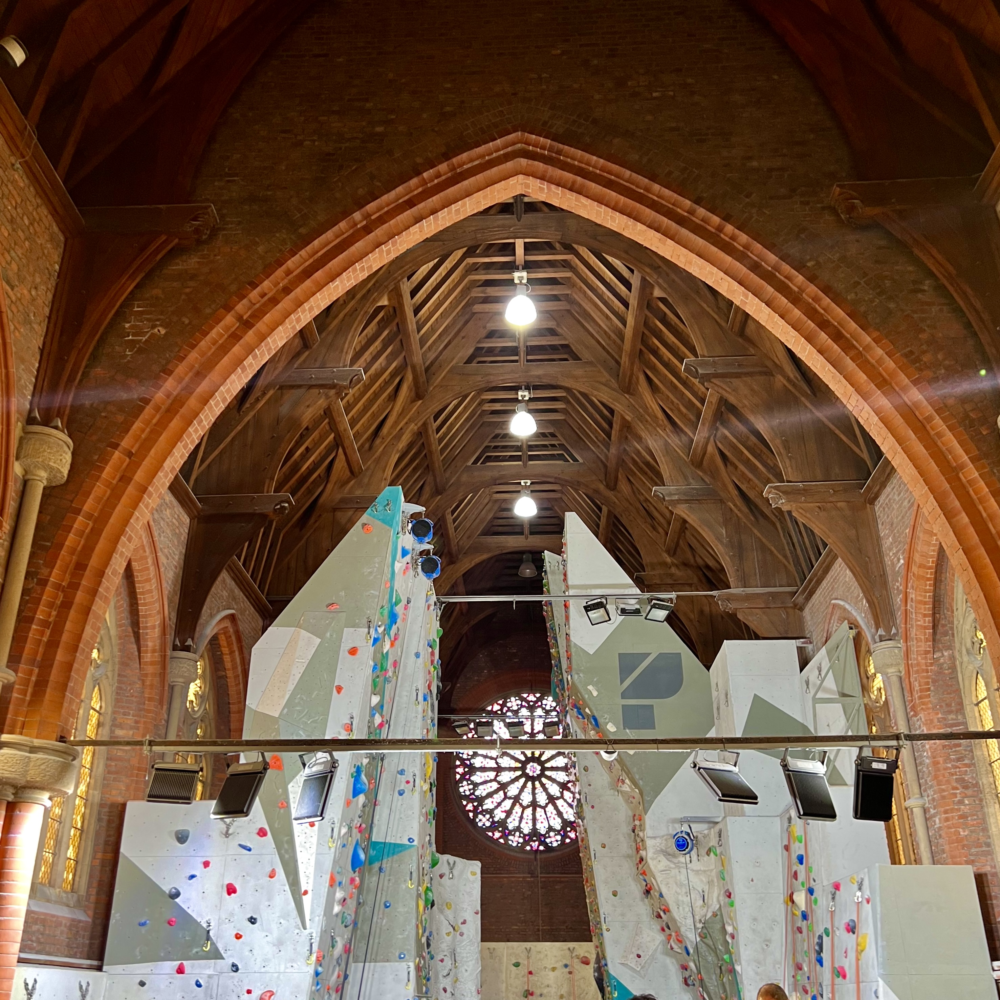
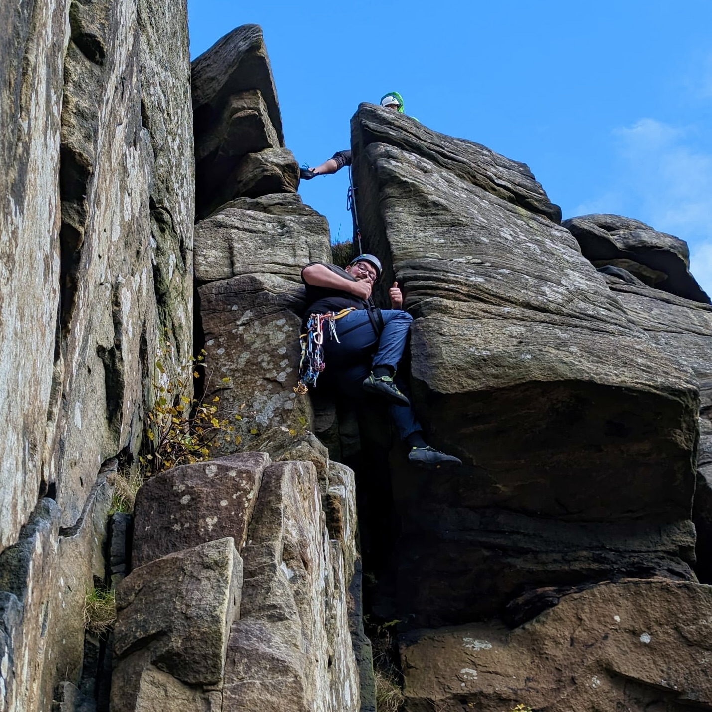

I have been an active and dedicated member of the Imperial College Mountaineering Club ([ICMC](https://icmountaineering.co.uk/)), where I have been involved in both the club’s operations and the wider London climbing community. My passion for climbing extends across multiple disciplines, from bouldering to sport climbing, lead climbing, and traditional (trad) climbing. This breadth of experience has not only allowed me to develop a deep personal love for the sport but also to contribute to the climbing community around me.

As a part of ICMC, I have taken on numerous responsibilities. These have included providing transport on trips, and assisting in managing the club’s climbing gear, from tidying and organising the climbing store to ordering and collecting new equipment.

  

    

      
      

        
Outdooring Bouldering in the Lake District

      

    

    

      
      

        
Early Morning Bouldering at Ravenswall

      

    

    

      
      

        
Outdooring Bouldering in the Peak District

      

    

    

      
      

        
Indoor Climbing at Parthian Manchester

      

    

    

      
      

        
Ravenswall: Andrew's Regular Climbing Gym

      

    

    

      
      

        
Trad Climbing in Froggatt

      

    

  

  <a class="carousel-control-prev" href="#climbingCarousel" role="button" data-slide="prev">
    
    Previous
  </a>
  <a class="carousel-control-next" href="#climbingCarousel" role="button" data-slide="next">
    
    Next
  </a>

Moreover, I am passionate about sharing my knowledge and enthusiasm for climbing with others. I have actively participated in teaching beginners how to top rope and lead climb, helping them develop their skills and confidence on the wall. I have organised and led social bouldering sessions, creating a welcoming and inclusive environment where climbers of all levels can improve and connect.

Beyond my involvement with ICMC, I have been an active participant in the London climbing community. Recognising the importance of efficiency and precision in the management of climbing centres, I have developed a cost calculator app for the staff at the London Climbing Centres ([LCC](https://londonclimbingcentres.co.uk)), which can be accessed at [CalculateCost](https://calculatecost.streamlit.app/).

In addition to my climbing pursuits, I am committed in maintaining a high level of physical fitness. I regularly engage in strength training at the gym, running, and other fitness activities to enhance my overall endurance and performance.
