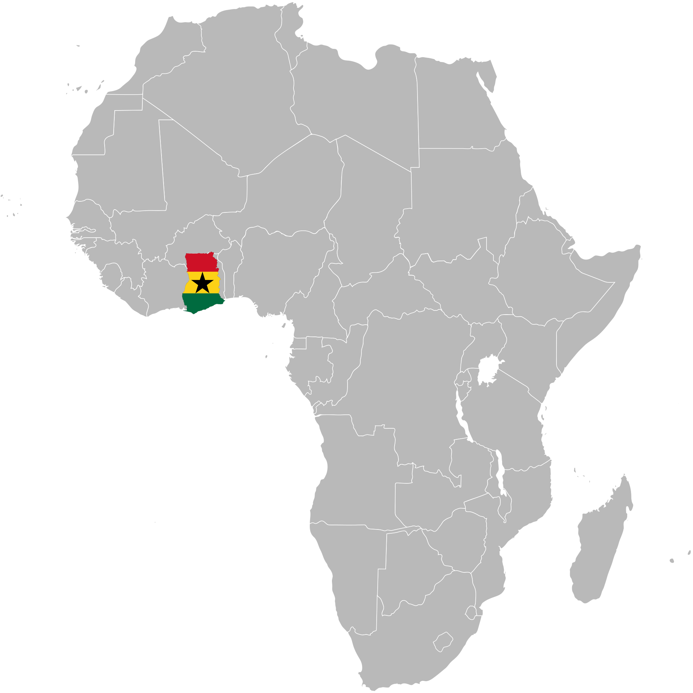

+++
# Project title.
title = "Water Wheel"

# Date this page was created.
date = 2016-04-27T00:00:00

# Project summary to display on homepage.
summary = "Water Wheel uses the ideas of a bike that produces electricity while cycling but couples this with a simple but highly effective filtration device. When cycling, the bike not only stores the energy produced from pedalling but also is able to produce electricity while filtering water. The Enactus Lancaster Ghana team is sourcing renewable materials, such as bamboo, to build the bike while working alongside Enactus Lancaster’s engineers and physicists to integrate the technology within the bike."

# Tags: can be used for filtering projects.
# Example: `tags = ["machine-learning", "deep-learning"]`
tags = ["charitable"]

# Optional external URL for project (replaces project detail page).
external_link = ""

# Slides (optional).
#   Associate this project with Markdown slides.
#   Simply enter your slide deck's filename without extension.
#   E.g. `slides = "example-slides"` references 
#   `content/slides/example-slides.md`.
#   Otherwise, set `slides = ""`.
slides = ""

# Links (optional).
url_pdf = ""
url_slides = ""
url_video = ""
url_code = ""

# Custom links (optional).
#   Uncomment line below to enable. For multiple links, use the form `[{...}, {...}, {...}]`.
# links = [{icon_pack = "fab", icon="twitter", name="Follow", url = "https://twitter.com/georgecushen"}]

# Featured image
# To use, add an image named `featured.jpg/png` to your project's folder. 
[image]
  # Caption (optional)
  caption = ""
  
  # Focal point (optional)
  # Options: Smart, Center, TopLeft, Top, TopRight, Left, Right, BottomLeft, Bottom, BottomRight
  focal_point = "Smart"
+++

Enactus Lancaster is branching out to have overseas members at our international campuses. Lancaster University Ghana have given us a unique insight in how a team can bridge continents and how multi-cultural thinking can lead to better solutions. The team in Ghana presented us with several issues that the country faces on a daily basis, including sanitation and electricity shortages. Dumsor has regular power outages that occur in the suburbs leaving whole neighbourhoods without electricity for extended periods of time.

<tr>
    <td>  </td>
    <td>  </td>
</tr>

Water Wheel uses the ideas of a bike that produces electricity while cycling but couples this with a simple but highly effective filtration device. When cycling, the bike not only stores the energy produced from pedalling but also is able to produce electricity while filtering water. The Enactus Lancaster Ghana team is sourcing renewable materials, such as bamboo, to build the bike while working alongside Enactus Lancaster’s engineers and physicists to integrate the technology within the bike.

A livable income can be generated through employment at local bike shops, where the beneficiaries will sell the bikes to the greater area. Currently, our team in Ghana are reaching out to the rural areas to find beneficiaries to work with.

Though this project is relatively new, it has already gained attention from the university as well as other Enactus teams. The science behind the bike was developed by ex-Team Leader Andrew Connell who came up with the inital designs in early 2019. Since then, the project has been taken on by a larger team who are hoping to have a fully operational shop by the end of 2020.



Please contact enactus@lancaster.ac.uk if you wish to know more or get involved with the project.

